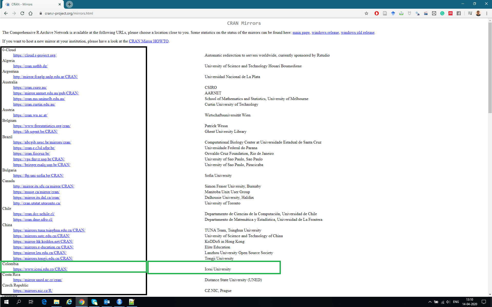
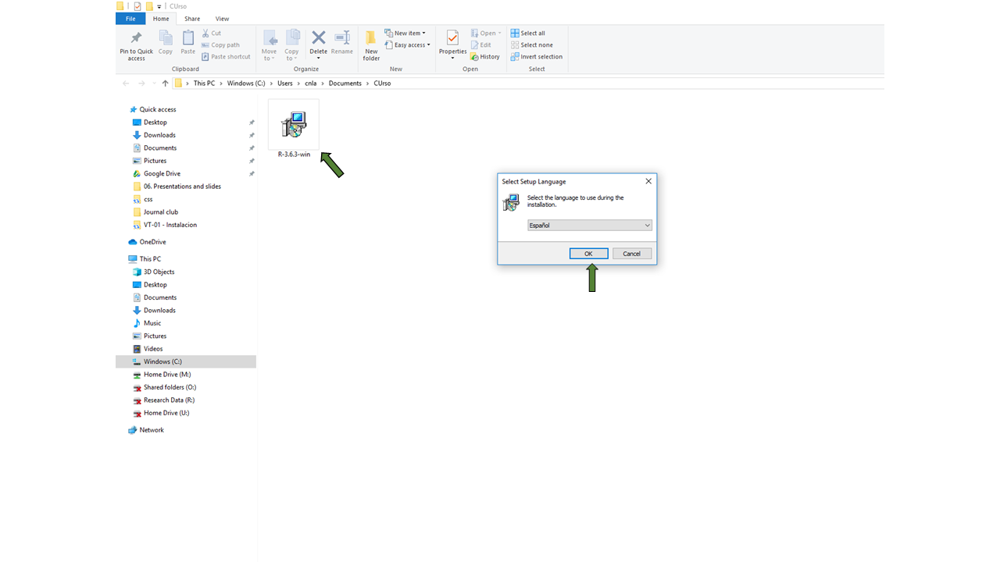
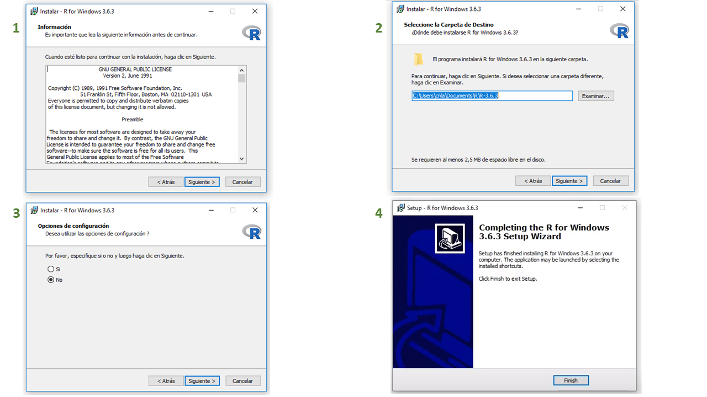
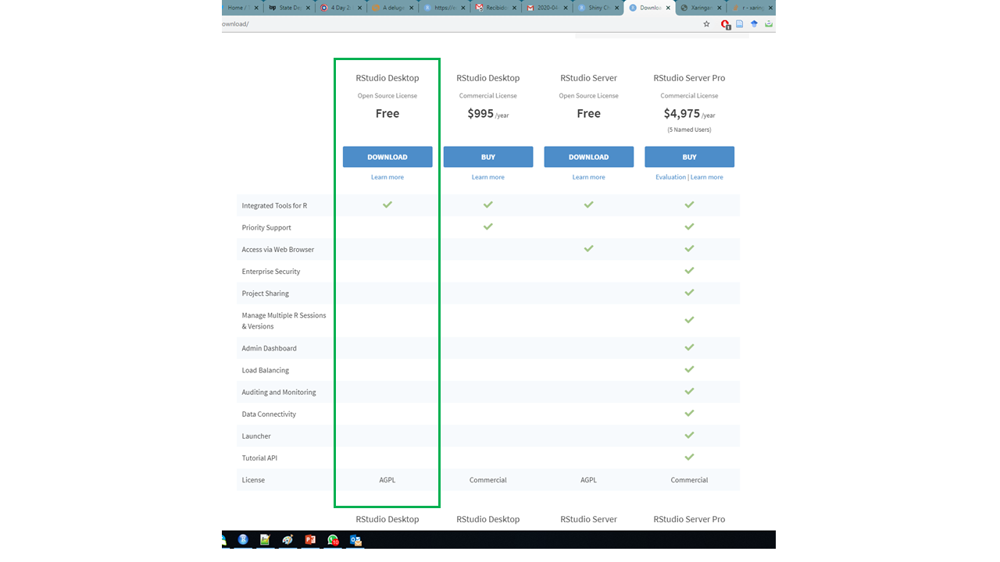
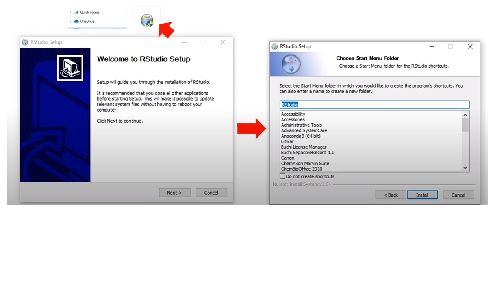
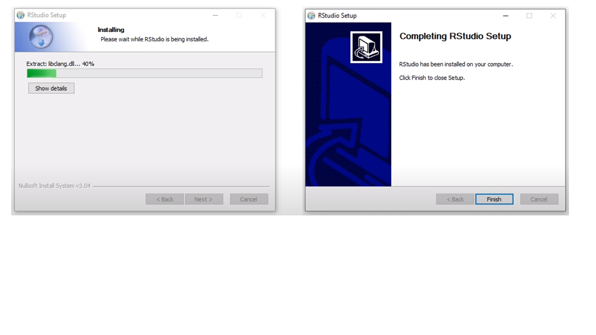
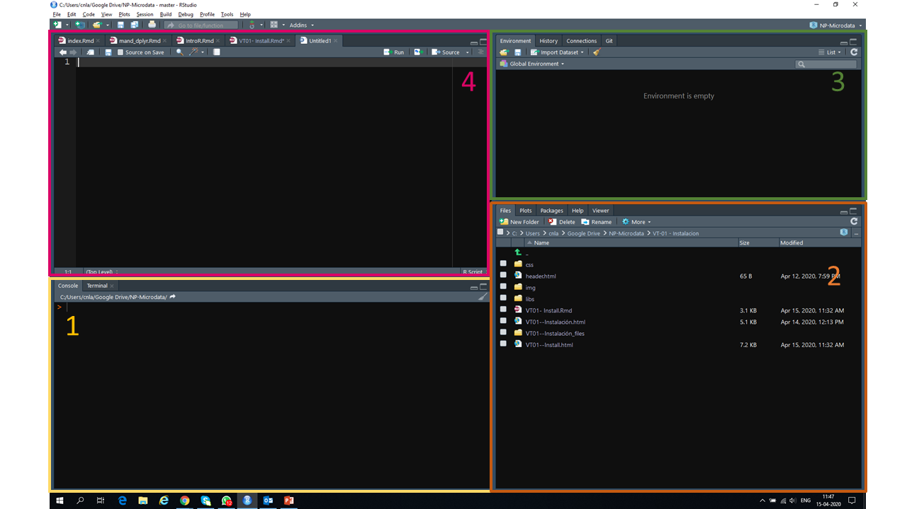

```{r setup, include=FALSE}
knitr::opts_chunk$set(echo = FALSE)
```
class: middle center 

## 

<h2> El objetivo de este videotutorial es instalar, configurar y correr R y Rstudio en su computador `r emo::ji("dart")` </h2>


---

## Para completar las actividades prácticas de este módulo necesitamos instalar los siguientes programas: 

1) [R -project](https://www.r-project.org/)


2) [R-studio](https://rstudio.com/)
 

---


## `r emo::ji("1st_place_medal")` Instalando R 

Podemos instalar **R** desde el siguiente link: https://www.r-project.org/


|Sistema Operativo | Método   |
|------------------|----------|
|   Windows        | https://cran.r-project.org/bin/windows/base/old/3.6.0/R-3.6.0-win.exe|
|Debian y derivados|`sudo apt-get install r-base`                           |
|Redhat y derivados| `sudo yum install R-core R-devel`                      |
|     Mac          | https://www.youtube.com/watch?v=ICGkG7Gg6j0   


---


## `r emo::ji("1st_place_medal")` Instalando R 

1) Vamos a: https://cran.r-project.org/mirrors.html

2) Seleccionar la ubicación más cercana: _Colombia - Universidad ICESI_

```{r, echo=FALSE,fig.align='center', out.width = "700px"}
      
```

---

## `r emo::ji("1st_place_medal")` Instalando R 

```{r, echo=FALSE,fig.align='center', out.width = "900px"}
      
```

---

## `r emo::ji("1st_place_medal")` Instalando R 

```{r, echo=FALSE,fig.align='center', out.width = "900px"}
      
```

---

## `r emo::ji("2nd_place_medal")` Instalando RStudio 

1) Vamos a: https://rstudio.com/products/rstudio/download/

2) Seleccionar la versión para escritorio: __Desktop open source license__

```{r, echo=FALSE,fig.align='center', out.width = "800px"}
      
```


---

## `r emo::ji("2nd_place_medal")` Instalando RStudio 


```{r, echo=FALSE,fig.align='center', out.width = "900px"}
      
```

---


## `r emo::ji("2nd_place_medal")` Instalando RStudio 


```{r, echo=FALSE,fig.align='center', out.width = "700px"}
      
```

> Todo esta listo!! Ahora empezaremos con un _"Hello World, R"_`r emo::ji("smile")`

---

```{r, echo=FALSE,fig.align='center', out.width = "1000px"}
      
```

---

## Sistema de ayudas

+ Sistema nativo de ayudas de R 
+ Stackoverflow 
+ rseek.org

---
