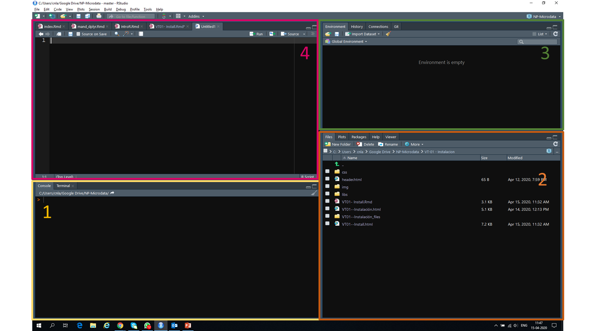
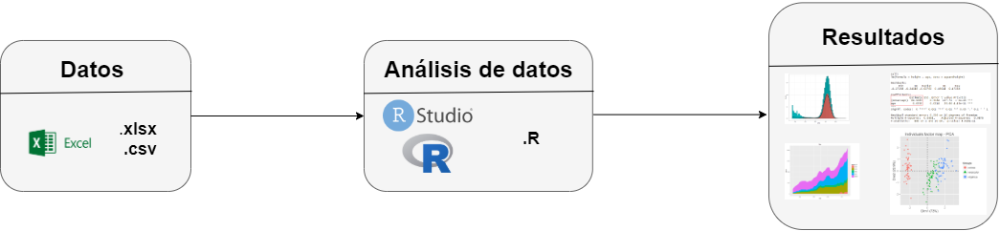
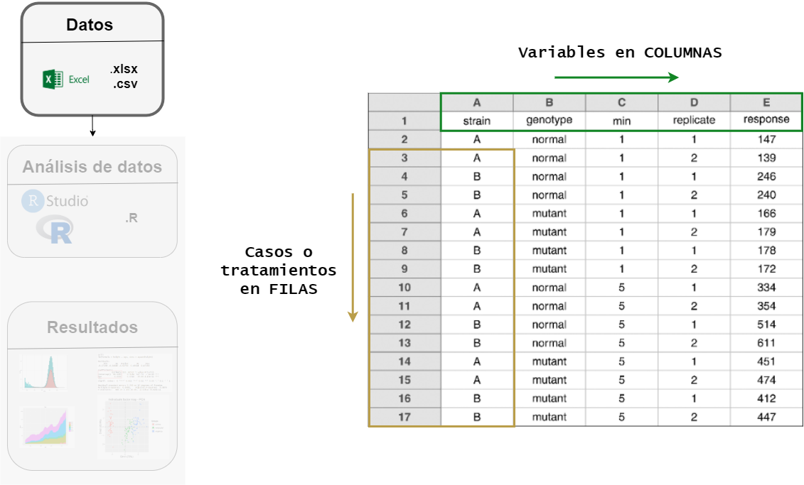
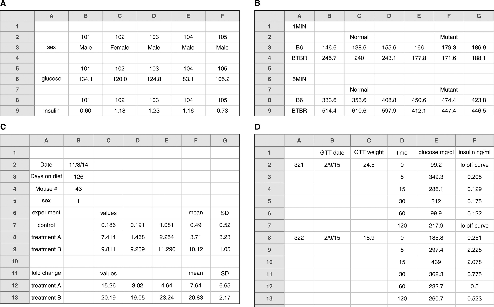
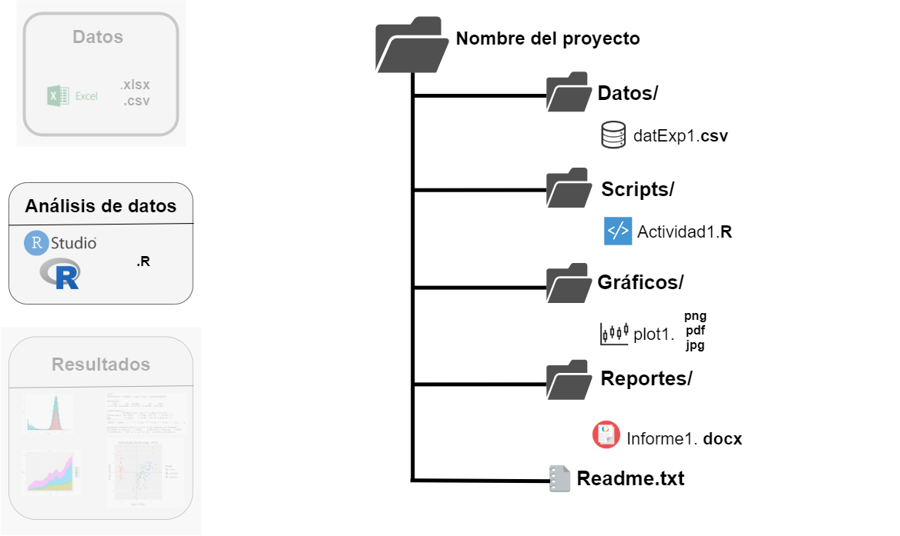
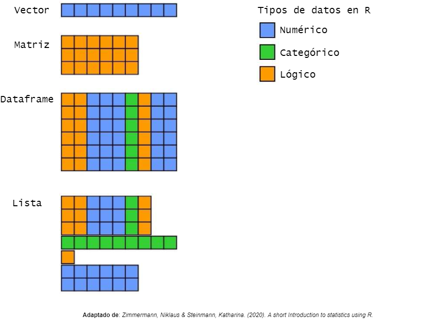
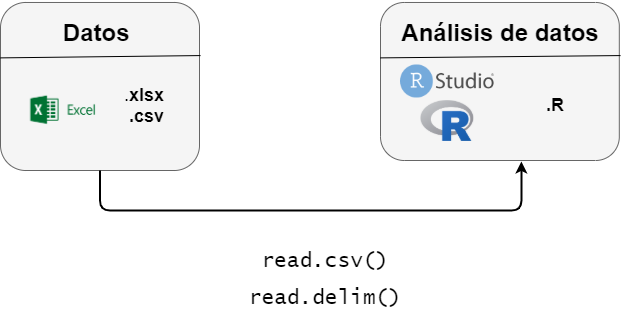

```{r setup, include=FALSE}
knitr::opts_chunk$set(echo = FALSE)
```


## 

<h2> `r emo::ji("dart")` En este videtutorial aprenderemos a: </h2>

  + Configurar un flujo de trabajo para el análisis de datos en Rstudio
  
  + Primeros pasos
  
  + Importando datos a Rstudio
  
  + Sistema de ayudas en R 


---

## Interfaz  de Rstudio

```{r, echo=FALSE,fig.align='center', out.width = "900px"}
      
```

---

## Flujo de trabajo propuesto para el Módulo


```{r, echo=FALSE,fig.align='center',fig.retina=2, out.width = "800px"}
      
```


---

## Flujo de trabajo: Preparación de datos en Excel  


```{r, echo=FALSE,fig.align='center',fig.retina=2, out.width = "900px"}
      
```

---


## Haz un rectángulo .... y evita esto `r emo::ji("woman_facepalming")`



---

## No celdas vacías `r emo::ji("warning")`


---

##  Se consitente `r emo::ji("cake")` ... 


.pull-left[

+ Codifica correctamente las variables categóricas
 
+ Usa nombre de _variables_ apropiados
 
+ Codifica adecuadamente los datos perdidos: _NA_ o dejar vacío

+ Evitar cálculos y fórmulas 

+ Evitar comentarios y unidades en las celdas

]

.pull-right[

| Buen nombre  `r emo::ji("clap")`| Alternativa  `r emo::ji("roll_eyes")` | Evitar `r emo::ji("broken_heart")`              |
|--------------------|-------------|---------------------|
| Max_Temp_C         | MaxTempC    | Maximum Temp (◦C)   |
| Cell_Type          | CellType    | Cell Type           |
| Precipicitacion_mm | Precmm      | Precipitacion mm    |
| Growth_rate        | GrowthRate  | Tasa de crecimiento |

]


---

## Flujo de trabajo: Creando proyectos en Rstudio

```{r, echo=FALSE,fig.align='center',fig.retina=2, out.width = "900px"}
      
```

---


##   Recordando :  Tipo de datos 

```{r, echo=FALSE,fig.align='center',fig.retina=2, out.width = "700px"}
      
```


---

## Primeros pasos en R: Importando datos

.pull-left[

```{r echo=FALSE, fig.align='left', fig.retina=2, out.width="700px"}
      
```
]

.pull-right[

```{r echo=TRUE, message=FALSE, warning=FALSE}

datos1 <- #<< 
  read.csv('../Datos/Datos-Actividad1.2.csv', 
           header = T, 
           sep = ';') 
```

+ Creamos un __objeto 'vacío'__ el cual contedrá los datos. 

]

---

## Primeros pasos en R: Importando datos

.pull-left[

```{r echo=FALSE, fig.align='left', fig.retina=2, out.width="700px"}
      
```
]

.pull-right[

```{r echo=TRUE, message=FALSE, warning=FALSE}

datos1 <-  
  read.csv('../Datos/Datos-Actividad1.2.csv', #<< 
           header = T, 
           sep = ';') 
```

 + Creamos un __objeto 'vacío'__ el cual contedrá los datos. 
 + Luego, mediante la función __read.csv()__ asignaremos nuestros datos    externos al __objeto vacío__. 
 
 
]

---

## Primeros pasos en R: Importando datos

.pull-left[

```{r echo=FALSE, fig.align='left', fig.retina=2, out.width="700px"}
      
```
]

.pull-right[

```{r echo=TRUE, message=FALSE, warning=FALSE}

datos1 <-  
  read.csv('../Datos/Datos-Actividad1.2.csv', #<< 
           header = T, sep = ';', dec = ',') #<<  
```


]

---

## Primeros pasos en R: Importando datos

```{r echo=FALSE, results = 'asis'}
library(knitr)

kable(datos1[1:8, 1:3])

```

---
