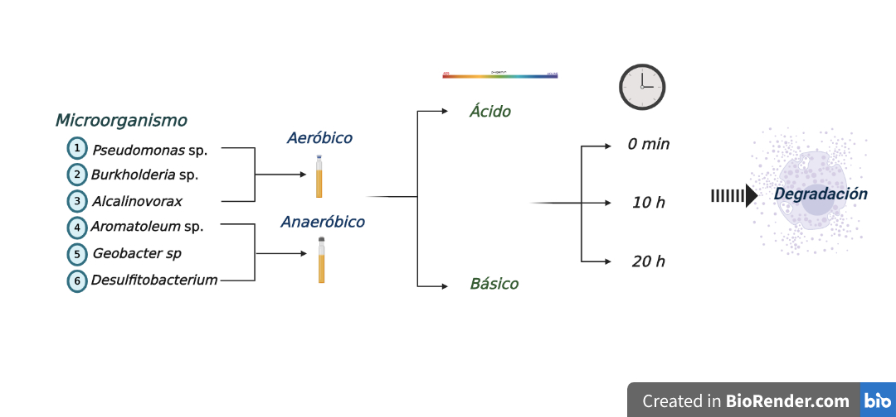
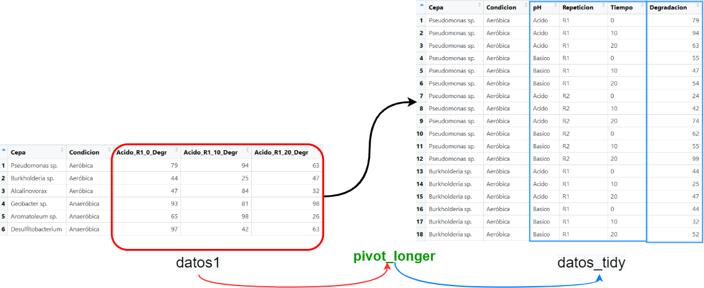
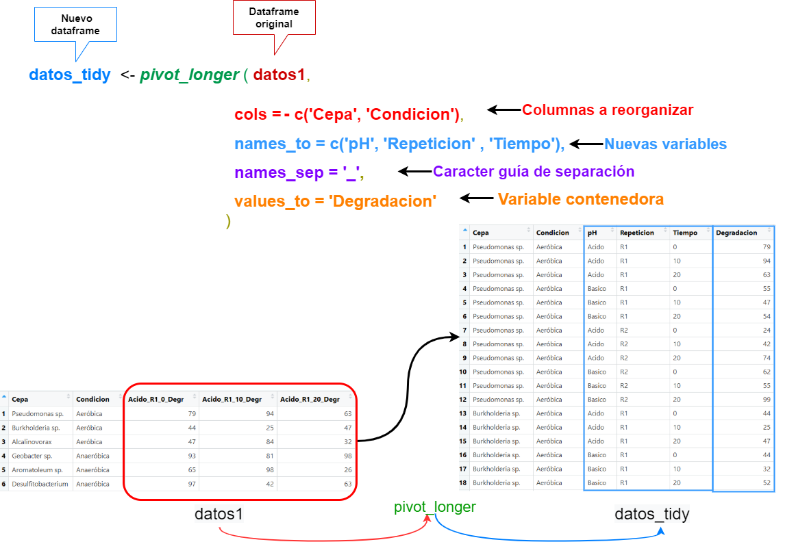

## 

 <h2> `r emo::ji("dart")` En este videtutorial aprenderemos a: </h2>
 
 + Transformación de datos a _tidy way_
 
 + Manipulando datos con _dplyr_
 
---

class: inverse, center, middle

# 1. Transformación de datos en R 

---

class: inverse, center, middle

# 1. Transformación de datos en R 
```{r, echo=FALSE,fig.align='center',fig.retina=2, out.width = "700px"}
   knitr::include_graphics('./img/dest.png')
``` 
---


class: center, middle

# Transformación de datos en R: Qué necesitamos? 
  ##   <i class="fa fa-table" aria-hidden="true"></i> Datos: _archivo.csv_ 
 
 ##   <i class="fa fa-cube" aria-hidden="true"></i> Paquetes: _tidyverse::tidyr_
 
 ### <i class="fa fa-cube" aria-hidden="true"></i> Funciones: `pivot_longer()`

---


# Transformación de datos en R: Qué necesitamos?

<h2> <i class="fa fa-table" aria-hidden="true"></i> Datos
</h2>

```{r, echo=FALSE,fig.align='center',fig.retina=2, out.width = "900px"}
      
```

---

# Transformación de datos en R: Objetivo

<h2> <i class="fa fa-table" aria-hidden="true"></i> Datos
</h2>

```{r, echo=FALSE,fig.align='center',fig.retina=2, out.width = "900px"}
      
```

---

# Transformación de datos en R: `pivot_longer()` 

```{r, echo=FALSE,fig.align='center',fig.retina=2, out.width = "700px"}
      
```

---


